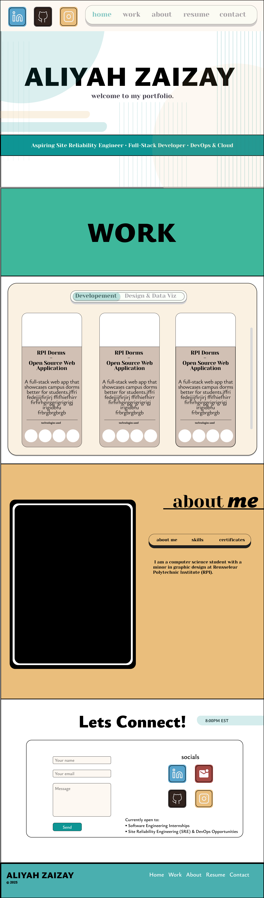

# Aliyah Zaizay — Portfolio

This is my personal portfolio website showcasing my work in software development, UI/UX design, and data-focused projects.

The site highlights selected projects, a short introduction about me, and ways to connect. It’s designed to be clean, responsive, and accessible across desktop, tablet, and mobile.

## Tech Stack
- HTML
- CSS
- JavaScript (as needed)
- Responsive design (Flexbox / Grid)

## Features
- Responsive layout for desktop, tablet, and mobile
- Project showcase section
- About Me section with background and interests
- Contact / social links

## Live Site
[]

## Status
Actively evolving — I update this site as I learn and build new projects.

---

Feel free to reach out if you’d like to connect or learn more about my work.
